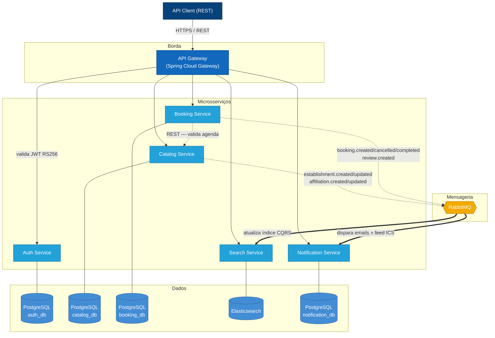

# Booking Hub — Sistema de Agendamento Distribuído

Sistema robusto e escalável de agendamento para serviços de beleza e bem-estar, desenvolvido como **Tech Challenge (Fase 3)** do curso de Arquitetura de Software da FIAP.

O projeto aplica na prática conceitos de microsserviços, Clean Architecture, comunicação event-driven, CQRS e integração com calendários externos, usando Java 21 e Spring Boot 3.

---

## Documentação

| Documento | Descrição |
|---|---|
| [Subindo a infraestrutura](docs/local-setup.md) | Docker Compose e execução local passo a passo |
| [Happy path via cURL](docs/happy-path-curl.md) | Fluxo completo de ponta a ponta para validação manual |
| [Collection + Environment Postman](docs/postman/) | Cobre todas as APIs do sistema em sequência — importe os dois arquivos no Postman e execute o fluxo completo sem precisar montar as requisições manualmente |
| [Swagger — API Gateway](http://localhost:8080/swagger-ui.html) | Documentação interativa de todos os serviços REST agregada pelo gateway. Permite inspecionar contratos e disparar requisições diretamente pelo browser. Não inclui a API GraphQL do search-service |
| [GraphiQL — Search Service](http://localhost:8085/graphiql) | IDE GraphQL interativa do search-service. Oferece autocompletar, documentação inline do schema e execução de queries flexíveis com qualquer combinação de filtros (texto, cidade, geolocalização, preço, rating) sem precisar construir o JSON da query à mão |

---

## Arquitetura

O sistema segue o padrão de **microsserviços event-driven** com bounded contexts isolados. O API Gateway é o único ponto de entrada externo e valida a assinatura dos JWTs (RS256) antes de rotear as requisições. A comunicação interna usa REST para operações síncronas e RabbitMQ para propagação assíncrona de eventos entre domínios.



---

## Microsserviços

| Serviço | Porta | Função |
|---|---|---|
| [**api-gateway**](api-gateway/README.md) | 8080 | Ponto único de entrada. Roteamento dinâmico, validação de JWT RS256 e injeção de identidade nos headers. |
| [**auth-service**](auth-service/README.md) | 8081 | Provedor de identidade (IdP). Registro de usuários, autenticação com BCrypt e emissão de JWT RS256. |
| [**catalog-service**](catalog-service/README.md) | 8083 | Domínio estrutural. CRUD de estabelecimentos, profissionais, catálogo de serviços e grades de horários. Publica eventos de domínio no RabbitMQ. |
| [**booking-service**](booking-service/README.md) | 8082 | Núcleo de negócio. Agendamentos com controle de concorrência (double-booking via índice único no PostgreSQL), ciclo de vida dos status e domínio de avaliações. |
| [**search-service**](search-service/README.md) | 8085 | CQRS read model. Consome eventos do RabbitMQ para manter índice no Elasticsearch. Expõe API GraphQL com busca por texto, geo, preço e rating. |
| [**notification-service**](notification-service/README.md) | 8086 | Event-driven. Consome eventos de booking para enviar e-mails e manter snapshots. Gera feed iCalendar (RFC 5545) compatível com Google Calendar, Outlook e Apple Calendar. |

---

## Stack

| Camada | Tecnologia |
|---|---|
| Linguagem | Java 21 |
| Framework | Spring Boot 3.2.3, Spring Cloud 2023.0.0 |
| Arquitetura de código | Clean Architecture (domain / application / infrastructure) |
| API externa | Spring Web MVC (REST + JSON) |
| API de busca | Spring for GraphQL (GraphQL sobre HTTP) |
| Gateway | Spring Cloud Gateway (reactive / WebFlux) |
| Mensageria | RabbitMQ 3 via Spring AMQP |
| Banco relacional | PostgreSQL 16 via Spring Data JPA + Flyway |
| Banco de busca | Elasticsearch 8.13 via Spring Data Elasticsearch |
| Segurança | Spring Security, JWT RS256 (Nimbus JOSE), BCrypt |
| E-mail (dev) | MailHog (SMTP fake) |
| Testes unitários | JUnit 5, Mockito, Testcontainers |
| Testes BDD | Cucumber 7, REST Assured |
| Testes de performance | k6 |
| Qualidade estática | Checkstyle (Google style), SpotBugs, PMD |
| Cobertura | JaCoCo (mínimo 80% de linhas) |
| Containerização | Docker, Docker Compose |
| CI/CD | GitHub Actions (matriz por módulo alterado) |

---

## Padrões e Convenções

### Arquitetura
- **Clean Architecture** em todos os serviços: camada de domínio sem dependências externas, casos de uso na camada de aplicação, adaptadores na infraestrutura.
- **Database per service**: cada microsserviço possui seu próprio schema PostgreSQL (`auth_db`, `catalog_db`, `booking_db`, `notification_db`) ou store dedicado (Elasticsearch para o search-service). Nenhum serviço acessa o banco do outro.
- **Event-Driven / Coreografia**: serviços reagem a eventos publicados no RabbitMQ sem acoplamento direto. Troca de mensagens assíncrona para atualização de read models (CQRS) e notificações.
- **CQRS** no search-service: writes chegam via eventos do RabbitMQ (catalog + review); reads são servidos pelo Elasticsearch via GraphQL.
- **Stateless JWT**: o API Gateway valida a assinatura RS256 do token sem consultar banco ou auth-service em cada requisição. A identidade é propagada via headers `X-User-Id` e `X-User-Role`.

### Código
- Migrações de schema versionadas com **Flyway** (`V1__`, `V2__`, …).
- Mensagens RabbitMQ serializadas em **JSON** via `Jackson2JsonMessageConverter`.
- Datas e horas em **ISO 8601** (`LocalDateTime` / `ZonedDateTime`), sem timestamps numéricos.
- Spring Profiles separados para `local` (localhost), `docker` (DNS dos containers) e `test` (H2 in-memory, AMQP mockado).
- Variáveis de ambiente com fallback seguro: `${DB_HOST:localhost}`.

### Testes
- Testes unitários excluem `*IT.java` e `CucumberTest.java` — rodados separadamente no CI.
- BDD com Cucumber: features em `src/test/resources/features/`, step definitions em `src/test/java/.../steps/`.
- Cobertura mínima de **80% de linhas** (exclui entidades JPA, DTOs, classes de configuração e Application).
- Testes de performance com **k6** em `performance-tests/k6/` — executados apenas em push/PR para `main`.

### Qualidade
- Google Java Style Guide via Checkstyle.
- SpotBugs (esforço máximo, limiar médio) + PMD (`java/quickstart.xml`) no CI.
- Pipeline com detecção inteligente de módulos alterados — apenas os serviços modificados passam pela matriz de build, análise estática, testes e BDD.

---

## Pipeline de CI

Definida em `.github/workflows/ci.yml`. Dispara em push para `main`, `develop` e `feature/**`, e em pull requests para `main` e `develop`.

### Estratégia: matriz dinâmica por módulo

Antes de qualquer job de validação, o pipeline detecta quais módulos foram alterados no commit/PR. Cada job subsequente recebe uma matriz e roda **em paralelo, apenas para os módulos afetados**. Mudanças exclusivas em `docs/` encerram o pipeline após a detecção — sem consumir minutos de CI desnecessariamente. Mudanças em `pom.xml` ou nos próprios workflows disparam todos os módulos.

### Jobs (executados em sequência, paralelos por módulo)

```
detect-changes → build → static-analysis → unit-tests → bdd-integration → docker-build-check
                                                                         ↘ performance-tests
```

| # | Job | Condição de execução | O que valida e por quê |
|---|---|---|---|
| 0 | **Detect Changed Modules** | Sempre | Identifica quais módulos tiveram código alterado usando `dorny/paths-filter`. Produz a matriz dinâmica consumida por todos os jobs seguintes. Evita rodar a pipeline completa para mudanças irrelevantes. |
| 1 | **Build** | Módulos alterados | Compila o módulo com `mvn compile -pl <module> -am` (inclui dependências locais). Falha rápida: problema de compilação não avança para análise ou testes. |
| 2 | **Static Analysis** | Após build | Roda **Checkstyle** (estilo Google), **SpotBugs** (bugs em bytecode) e **PMD** (code smells) em sequência. Código fora do padrão ou com bugs detectáveis estaticamente não chega aos testes. Relatórios XML são publicados como artefatos em caso de falha. |
| 3 | **Unit Tests + Coverage** | Após análise estática | Executa testes unitários (exclui `*IT` e `CucumberTest`), gera relatório JaCoCo e impõe **mínimo de 80% de cobertura de linhas**. Relatório HTML publicado como artefato por 7 dias. Exclui entidades JPA, DTOs e classes de configuração da métrica. |
| 4 | **BDD & Integration** | Após testes unitários | Sobe PostgreSQL 16, RabbitMQ 3 e Elasticsearch 8.13 como *services* do GitHub Actions. Roda testes `*IT` (Testcontainers) e cenários Cucumber separadamente, com `SPRING_PROFILES_ACTIVE=test`. Relatórios Cucumber publicados como artefatos por 7 dias. |
| 5 | **Docker Build Check** | PRs para `main` | Constrói a imagem Docker de cada módulo alterado com `docker build -f <module>/Dockerfile`. Garante que o `Dockerfile` (multi-stage) está funcional antes do merge. Não faz push — validação apenas. |
| 6 | **Performance Tests (k6)** | Push/PR para `main` | Sobe a stack completa com `docker compose up --build`, aguarda 60 s e executa o script k6 em `performance-tests/k6/booking-load-test.js` contra `http://localhost:8080`. Roda apenas em `main` para não bloquear feature branches com testes longos. |
