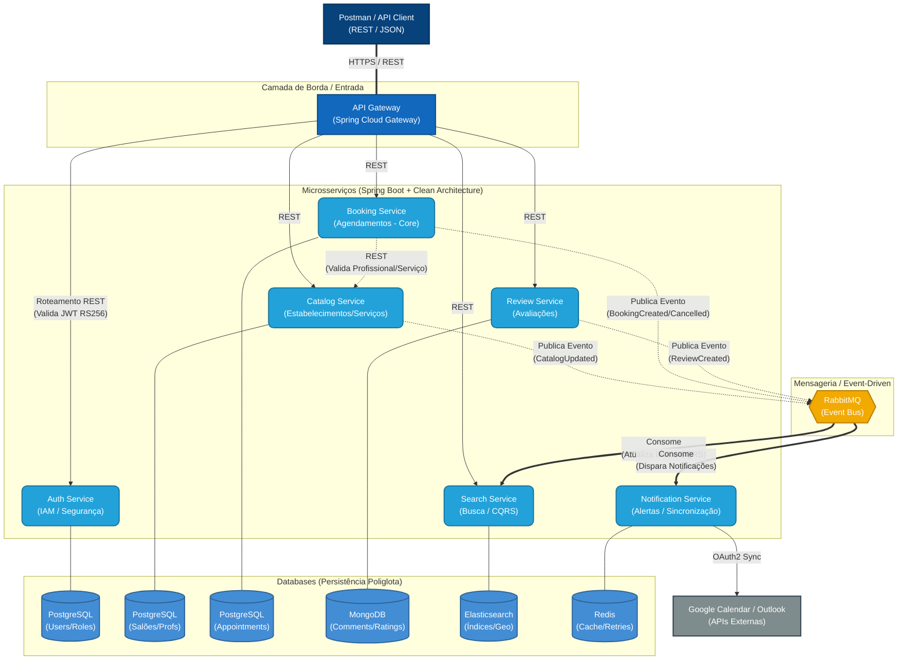

# 💇‍♀️ Booking HUB - Sistema de Agendamento distribuído

Bem-vindo ao repositório central do **Beauty & Wellness**, um sistema robusto, escalável e de alta disponibilidade para agendamento e gerenciamento de serviços de beleza e bem-estar.

Este projeto foi desenvolvido como requisito do Tech Challenge (Fase 3), aplicando conceitos avançados de Arquitetura de Software, Clean Architecture, Microsserviços e Cloud Native.

---

## 🏗️ Visão Geral da Arquitetura

O sistema foi desenhado sob uma arquitetura de **Microsserviços Event-Driven**, garantindo escalabilidade independente, tolerância a falhas e separação clara de domínios (Bounded Contexts). 

Optamos por uma abordagem de **Persistência Poliglota**, utilizando o banco de dados mais adequado para o padrão de acesso de cada microsserviço (Relacional, Documentos, Motor de Busca e Chave-Valor). Toda a comunicação com clientes externos é centralizada por um **API Gateway**, que atua como *Edge Service* e validador de segurança (Stateless JWT).

### Padrões de Comunicação
- **Externa (Cliente ↔ Gateway):** RESTful (JSON) sobre HTTPS.
- **Interna Síncrona (Serviço ↔ Serviço):** RESTful (JSON) para chamadas entre serviços (ex: validação de disponibilidade no momento do agendamento).
- **Interna Assíncrona (Event-Driven):** Mensageria com `RabbitMQ` para desacoplamento, Coreografia de Sagas e atualização de bases de leitura (Padrão CQRS).

---

## 🗺️ Diagrama de Arquitetura

Abaixo está o fluxo macro de comunicação, segurança e dados do ecossistema:



---

## 🧩 Ecossistema de Componentes

### 1. API Gateway (`api-gateway`)
Ponto único de entrada (Spring Cloud Gateway). Responsável pelo roteamento dinâmico e pela **validação de segurança** (verificação da assinatura matemática da chave pública RS256 do JWT), repassando a identidade do usuário para os serviços de *backend* via *Headers* sem sobrecarregá-los com regras de IAM.

### 2. Auth Service (`auth-service`)
Provedor de Identidade (IdP). Responsável por registrar usuários, validar credenciais (e-mail/senha com BCrypt) e emitir os *JSON Web Tokens* (JWT) usando uma chave privada RSA. Protege rigorosamente os dados de acesso no seu próprio PostgreSQL.

### 3. Catalog Service (`catalog-service`)
Gerencia o domínio de negócios estruturais: cadastro de Estabelecimentos, Profissionais associados, Horários de Funcionamento e Serviços (com preço e duração).

### 4. Booking Service (`booking-service`)
O "coração" do sistema. Aplica regras rígidas de concorrência no banco de dados relacional (PostgreSQL) para evitar *double-booking* (agendamentos duplicados no mesmo horário). Comunica-se via REST com o catálogo para consultas de disponibilidade.

### 5. Review Service (`review-service`)
Coleta notas e comentários após a finalização de um serviço. Utiliza MongoDB pela flexibilidade de esquema na persistência de avaliações em texto livre.

### 6. Search Service (`search-service`)
Motor de busca e descoberta altamente otimizado. Implementa o padrão **CQRS** (Command Query Responsibility Segregation) escutando eventos do RabbitMQ para construir um índice consolidado no **Elasticsearch**, permitindo buscas ultrarrápidas por geolocalização, serviços oferecidos e melhor avaliação.

### 7. Notification Service (`notification-service`)
Microsserviço puramente reativo/orientado a eventos. Escuta o barramento do RabbitMQ para disparar e-mails/SMS de confirmação e realizar a integração (sincronização) com APIs externas, como o Google Calendar.

---

## 🛠️ Stack Tecnológica Base

* **Linguagem:** Java 21
* **Framework Principal:** Spring Boot 3.x / Spring Cloud
* **Arquitetura de Código:** Clean Architecture (Domain, Application, Infrastructure)
* **Comunicação:** RESTful (Spring Web), RabbitMQ (Spring AMQP)
* **Bancos de Dados:** PostgreSQL (Relacional), MongoDB (NoSQL Documento), Elasticsearch (Busca), Redis (Cache)
* **Segurança:** Spring Security, OAuth2 / JWT (RS256 Criptografia Assimétrica), BCrypt
* **Qualidade e Testes:** JUnit 5, Mockito, Testcontainers, Cucumber (BDD), k6 (Performance)
* **Infraestrutura/DevOps:** Docker, Docker Compose, GitHub Actions (CI/CD), AWS ECS (Deploy)

---

## 📁 Estrutura do Monorepo

O projeto segue a estrutura de monorepo multi-módulo (via Maven ou Gradle), centralizando a infraestrutura, mas mantendo o isolamento de código de cada serviço:

```text
beauty-wellness-system/
 ├── .github/workflows/       # Pipelines de CI/CD
 ├── infra/                   # Arquivos globais de infra
 │    ├── docker-compose.yml  # Sobe BDs, RabbitMQ e Gateway locais
 │    └── grafana/            # Dashboards de observabilidade
 │
 ├── api-gateway/             # Roteamento e Filtro JWT
 ├── auth-service/            # Emissão de Tokens e IAM
 ├── catalog-service/         # Clean Architecture (Core, Application, Infra)
 ├── booking-service/         # Clean Architecture (Core, Application, Infra)
 ├── review-service/          # Clean Architecture (Core, Application, Infra)
 ├── search-service/          # Microsserviço de indexação
 └── notification-service/    # Worker assíncrono
```

---

## 🚀 Como Executar

### Opção 1 — Docker Compose (recomendado)

Sobe toda a stack (infra + serviços) com um único comando. As imagens são construídas via **multi-stage build** — não é necessário ter Maven instalado localmente.

```bash
docker compose up -d --build
```

Aguarde todos os containers estarem saudáveis (≈ 60 s na primeira execução):

```bash
docker compose ps          # verifique o estado dos containers
docker compose logs -f     # acompanhe os logs em tempo real
```

| Serviço          | URL local                                      |
|------------------|------------------------------------------------|
| API Gateway      | http://localhost:8080 · Swagger: `/swagger-ui.html` |
| Auth Service     | http://localhost:8081 · Swagger: `/swagger-ui.html` |
| Catalog Service  | http://localhost:8083 · Swagger: `/swagger-ui.html` |
| Booking Service  | http://localhost:8082 · Swagger: `/swagger-ui.html` |
| RabbitMQ UI      | http://localhost:15672 (guest / guest)         |

### Opção 2 — Execução local (IntelliJ / linha de comando)

Requer PostgreSQL e RabbitMQ rodando localmente. Crie os bancos manualmente antes de iniciar:

```sql
CREATE DATABASE auth_db;
CREATE DATABASE catalog_db;
CREATE DATABASE booking_db;
```

Execute cada serviço (perfil `default` usa localhost para todos os recursos):

```bash
cd auth-service    && mvn spring-boot:run
cd catalog-service && mvn spring-boot:run
cd booking-service && mvn spring-boot:run
cd api-gateway     && mvn spring-boot:run
```

---

## 🧪 Testes

```bash
mvn test                        # todos os módulos
mvn test -pl booking-service    # módulo específico
mvn verify                      # testes + relatório JaCoCo (target/site/jacoco/)
```

Cobertura mínima exigida: **80% de linhas** (excluindo entidades JPA e DTOs).

---

## 🔄 Happy Path — Fluxo Completo de Agendamento

O fluxo completo envolve três atores: **Owner** (dono do salão), **Professional** (profissional) e **Client** (cliente). Todos os exemplos abaixo usam a API Gateway em `http://localhost:8080`.

> Substitua os valores de `id` retornados por cada request nas variáveis indicadas.

---

### Passo 1 — Registrar os usuários

```bash
# Owner
curl -s -X POST http://localhost:8080/api/auth/register \
  -H "Content-Type: application/json" \
  -d '{"email":"owner@salon.com","password":"Senha123!","role":"ROLE_OWNER"}'

# Professional
curl -s -X POST http://localhost:8080/api/auth/register \
  -H "Content-Type: application/json" \
  -d '{"email":"prof@salon.com","password":"Senha123!","role":"ROLE_PROFESSIONAL"}'

# Client
curl -s -X POST http://localhost:8080/api/auth/register \
  -H "Content-Type: application/json" \
  -d '{"email":"cliente@email.com","password":"Senha123!","role":"ROLE_CLIENT"}'
```

---

### Passo 2 — Obter tokens JWT

```bash
# Owner → salve o token em OWNER_TOKEN
curl -s -X POST http://localhost:8080/api/auth/login \
  -H "Content-Type: application/json" \
  -d '{"email":"owner@salon.com","password":"Senha123!"}'
# → { "token": "<OWNER_TOKEN>" }

# Professional → PROF_TOKEN
curl -s -X POST http://localhost:8080/api/auth/login \
  -H "Content-Type: application/json" \
  -d '{"email":"prof@salon.com","password":"Senha123!"}'

# Client → CLIENT_TOKEN
curl -s -X POST http://localhost:8080/api/auth/login \
  -H "Content-Type: application/json" \
  -d '{"email":"cliente@email.com","password":"Senha123!"}'
```

---

### Passo 3 — Criar estabelecimento (Owner)

```bash
curl -s -X POST http://localhost:8080/api/catalog/establishments \
  -H "Content-Type: application/json" \
  -H "Authorization: Bearer <OWNER_TOKEN>" \
  -d '{
    "name": "Salão da Maria",
    "cnpj": "12.345.678/0001-99",
    "description": "Salão completo de beleza",
    "address": {
      "street": "Rua das Flores", "number": "100",
      "city": "São Paulo", "state": "SP", "zipCode": "01310-100"
    },
    "businessHours": [
      {"dayOfWeek": 1, "openTime": "09:00:00", "closeTime": "18:00:00"},
      {"dayOfWeek": 2, "openTime": "09:00:00", "closeTime": "18:00:00"},
      {"dayOfWeek": 3, "openTime": "09:00:00", "closeTime": "18:00:00"},
      {"dayOfWeek": 4, "openTime": "09:00:00", "closeTime": "18:00:00"},
      {"dayOfWeek": 5, "openTime": "09:00:00", "closeTime": "18:00:00"}
    ],
    "services": [
      {"title": "Corte Feminino", "description": "Corte e escova"},
      {"title": "Coloração", "description": "Coloração completa"}
    ]
  }'
# → { "id": "<EST_ID>", "providedServices": [{ "id": "<SVC_ID>", ... }], ... }
```

Anote o `id` do estabelecimento (`EST_ID`) e o `id` de um dos serviços (`SVC_ID`).

---

### Passo 4 — Criar perfil do profissional (Professional)

```bash
curl -s -X POST http://localhost:8080/api/catalog/professionals/me \
  -H "Content-Type: application/json" \
  -H "Authorization: Bearer <PROF_TOKEN>" \
  -d '{
    "name": "João Cabeleireiro",
    "bio": "10 anos de experiência em cortes femininos",
    "specialties": ["Corte", "Coloração"]
  }'
# → { "id": "<PROF_ID>", ... }
```

Anote o `id` do profissional (`PROF_ID`).

---

### Passo 5 — Afiliar profissional ao estabelecimento com agenda (Owner)

Use `dayOfWeek` de 1 (segunda) a 7 (domingo). Ligue `providedServiceId` ao `SVC_ID` obtido no Passo 3.

```bash
curl -s -X POST "http://localhost:8080/api/catalog/establishments/<EST_ID>/affiliations?professionalId=<PROF_ID>" \
  -H "Content-Type: application/json" \
  -H "Authorization: Bearer <OWNER_TOKEN>" \
  -d '{
    "active": true,
    "workSchedules": [
      {"dayOfWeek": 1, "startTime": "09:00:00", "endTime": "18:00:00"},
      {"dayOfWeek": 2, "startTime": "09:00:00", "endTime": "18:00:00"},
      {"dayOfWeek": 3, "startTime": "09:00:00", "endTime": "18:00:00"},
      {"dayOfWeek": 4, "startTime": "09:00:00", "endTime": "18:00:00"},
      {"dayOfWeek": 5, "startTime": "09:00:00", "endTime": "18:00:00"}
    ],
    "serviceOfferings": [
      {"providedServiceId": "<SVC_ID>", "price": 120.00, "durationMinutes": 60}
    ]
  }'
```

---

### Passo 6 — Consultar disponibilidade (público, sem token)

Escolha uma data futura que caia em dia de semana (ex: próxima segunda-feira).

```bash
curl -s "http://localhost:8080/api/bookings/availability?\
establishmentId=<EST_ID>&professionalId=<PROF_ID>&serviceId=<SVC_ID>&date=2026-04-07"
# → {
#     "durationMinutes": 60,
#     "price": 120.00,
#     "availableSlots": ["2026-04-07T09:00:00", "2026-04-07T10:00:00", ...]
#   }
```

---

### Passo 7 — Criar agendamento (Client)

Escolha um dos horários retornados no passo anterior como `startDatetime`.

```bash
curl -s -X POST http://localhost:8080/api/bookings \
  -H "Content-Type: application/json" \
  -H "Authorization: Bearer <CLIENT_TOKEN>" \
  -d '{
    "professionalId": "<PROF_ID>",
    "establishmentId": "<EST_ID>",
    "providedServiceId": "<SVC_ID>",
    "startDatetime": "2026-04-07T10:00:00",
    "notes": "Prefiro corte mais curto nas laterais"
  }'
# → { "id": "<BOOKING_ID>", "status": "CONFIRMED", "price": 120.00, ... }
```

---

### Passo 8 — Consultar agendamento (Client)

```bash
curl -s http://localhost:8080/api/bookings/<BOOKING_ID> \
  -H "Authorization: Bearer <CLIENT_TOKEN>"
# → { "id": "<BOOKING_ID>", "status": "CONFIRMED", ... }
```

---

### Passo 9 — Finalizar atendimento (Professional)

```bash
curl -s -X PATCH http://localhost:8080/api/bookings/<BOOKING_ID>/complete \
  -H "Authorization: Bearer <PROF_TOKEN>"
# → { "status": "COMPLETED", ... }
```

**Variante — Cancelar (Client ou Owner):**

```bash
curl -s -X PATCH http://localhost:8080/api/bookings/<BOOKING_ID>/cancel \
  -H "Content-Type: application/json" \
  -H "Authorization: Bearer <CLIENT_TOKEN>" \
  -d '{"reason": "Compromisso surgiu"}'
# → { "status": "CANCELLED", "cancelReason": "Compromisso surgiu", ... }
```

---

### Resumo do Fluxo

```
Owner registra → Owner cria estabelecimento + serviços
Professional registra → Professional cria perfil
Owner afilia Professional com agenda + preços
Client consulta disponibilidade (sem token)
Client cria booking → status: CONFIRMED → evento BookingCreated publicado no RabbitMQ
Professional finaliza → status: COMPLETED → evento BookingCompleted publicado
```